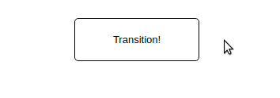

# Button Hover

Use a transition to scale the button when you hover your mouse over it.

## Desired Outcome

### Self Check
- Does the button grow when you hover it?
- Do other properties of the button remain unchanged?
- Does the `:hover` pseudo-class trigger the transition?
