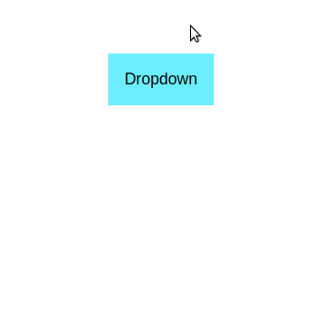

# Dropdown

Here you'll make your very own dropdown menu using pure CSS. 

Animate the appearance of a list so that it slides down when you hover your mouse over the button. This exercise will need multiple CSS selectors to get it working properly.

## Desired Outcome

### Self Check
- Does the button's background color change when you hover on it?
- Does the list smoothly slide down underneath the button when the button is hovered over?
- Does the list smoothly slide back up to hiding when the mouse is moved away from the button or a list element?
- Does the list appear and disappear when it is supposed to i.e. only when the mouse is over the button or a list element?