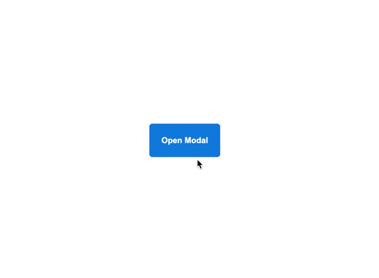

# Popup

In this exercise we have set up a simple pop-up dialog for you. It already works! Load up index.html and give it a shot!

You don't need to worry about the actual functionality here, we've just written a little javascript that adds and removes a `.show` class to the popup and the backdrop.  Your task then is to make it _move_, as in the desired-outcome image below.

### Hints
- "modal" is another word for 'pop-up'
- In the code we've provided, the popup is sitting in it's final position, so you'll need to change it's initial position, and then use a transition to move it back to the center.
- You might want to change the initial opacity from 0% to something like 20% while you're working on it, so you can easily see where it is coming from before you click the button.
- Don't overthink this one... it might seem complicated, but it requires just a few lines of code.

## Desired Outcome

### Self Check

- The pop-up slides down into position when you click the open button, and slides back up when you click 'close modal'
- The opacity fades smoothly in and out when toggling the modal. 