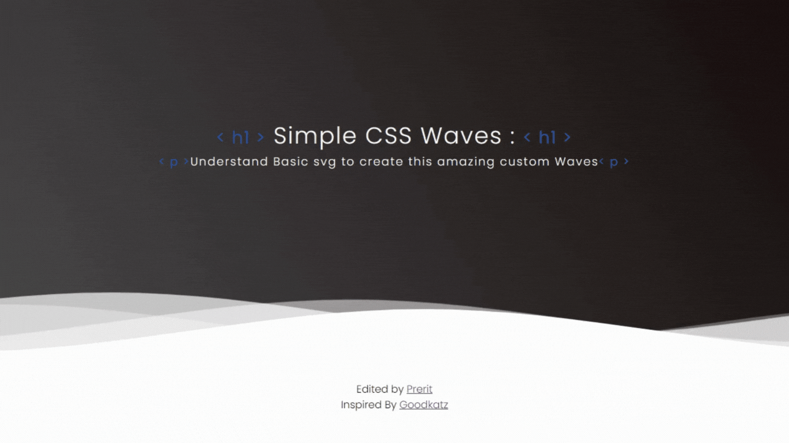

# CSS WAVES

In this exercise we'll understand how the wave effects work in css.

Do not do this like me using svg (until you are not clear with svgs).

Step 1: You've to create 3 or 4 divs(according to the layers of waves you want).

Step 2: Use the png image povided below for making waves and use them as a background image of the divs you've created.

Step 3: To make them move from left to right use animation property and set the duration followed by linear infinite to keep them moving continously then set the keyframes and your are ready to go.

## Image For Waves

## Desired Outcome

### Self Check
- The waves delay and keep moving in the motion according to your setup?
- Make sure that the Background color of body is not white.
