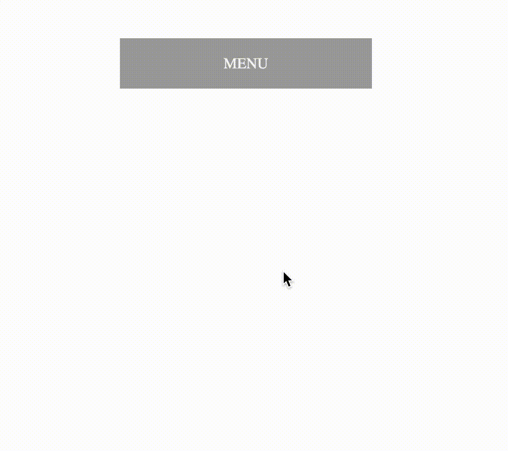

# Dropdown Menu

We've set up a dropdown menu in this exercise. Load up the page, you can see a single menu title, with a dropdown menu that will open upon clicking on the title. 

Your task is to add animation to the dropdown menu so that it will have an effect of expanding. Check out the desired outcome below, and notice the _bounce_ illusion when the dropdown expands close to its final end state. 

### Hints
- You need to specify a _transform-origin_ property to make the dropdown menu start transforming from the top
- You need to add an intermediate step to the keyframe at rule to implement the _bounce_ illusion.

## Desired Outcome

### Self Check

- The dropdown menu expands after you click on the menu title
- There's a _bounce_ illusion towards the end of the animation