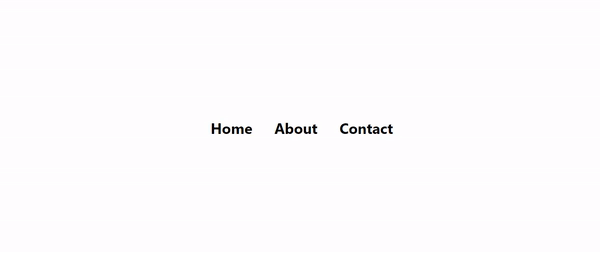

# Animating underline animation on mouse hover

We've set up a Animating underline animation on mouse hover in this exercise. Load up the page, you can see links that will animate underline when we hover on them

Your task is to add this animation to links so that it will have an effect of expanding. Check out the desired outcome below, and notice the smooth transition when the hover on the links.

### Hints

- you need to add before or after _pseudo_ elements to make underline

- use _position:relative_ on link for 100% width of underline.

## Desired Outcome

### Self Check

- The underline will come with smooth transition when hover on link
