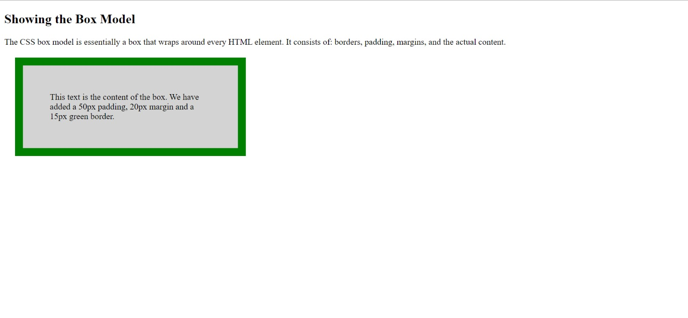

# An entire page!

The CSS Box Model
In CSS, the term "box model" is used when talking about design and layout.

The CSS box model is essentially a box that wraps around every HTML element. It consists of: margins, borders, padding, and the actual content.

### Hints

Content - The content of the box, where text and images appear
Padding - Clears an area around the content. The padding is transparent
Border - A border that goes around the padding and content
Margin - Clears an area outside the border. The margin is transparent

Instructions:-
Step 1- Add a heading at the top.
Step 2- Add a paragraph.
Step 3- Demonstrate the box model with following specifications: 
        • Add 50px padding,
        • 20px margin,
        • 15px green border and
        • Add some random text.

## Desired Outcome

### Self Check
- There is a heading at the top of the page.
- Then there is a paragraph.
- Then the final demonstration of the box model.

