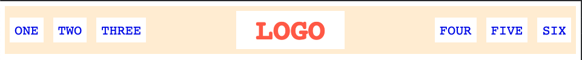
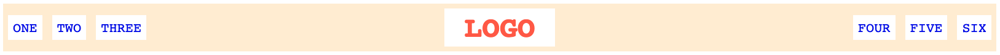

# A Basic Header

Use flexbox rules to create this very common webpage header style. The benefit to using flex here is that everything should be _flexible_. Check out the two screenshots below to get an idea for how it should scale with your screen. Besides flex rules, you'll also want to add some rules for margin and padding. (hint: `ul`s have some default margin/padding that you will need to deal with)

## Desired Outcome

narrow:

wide: 

### Self Check
- There is space between all items and the edge of the header (specific px amount doesn't matter here)
- Logo is centered vertically and horizontally.
- list-items are horizontal, and are centered vertically inside the header
- left-links and right-links are pushed all the way to the left and right, and stay at the edge of the header when the page is resized.
- This exercise does not use floats, inline-block, or absolute positioning.