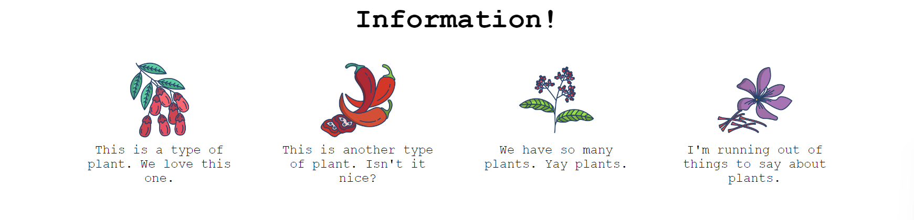

# A very common website feature

This exercise is to recreate a section that is found on many informational websites.

For this one you will need to edit the HTML a little bit too. We can't be making things _too_ easy for you. You'll want to add containers around the various elements so that you can flex them. Good luck!

## Desired outcome

### Self Check

- All items are centered on the page (horizontally, not vertically)
- Title is centered on the page
- 32px between the title and the 'items'
- 52px between each item
- Items are arranged horizontally on the page
- Items are only 200px wide and the text wraps
- Item text is centered

With This exercise I had the same approach that was applied to the solution by creating two divs to control how items where display,  I had some difficulties with the images not being centered, at the beggining I just added a " " line after the images that fixed the problem of the text not being under the image.
but I though, that is not the way, I looked at the Readme file, but that didnt help.  so at the end I compared my approach with the solution and I was going good but didnt think that centering the hole page in the body section was what I was missing.