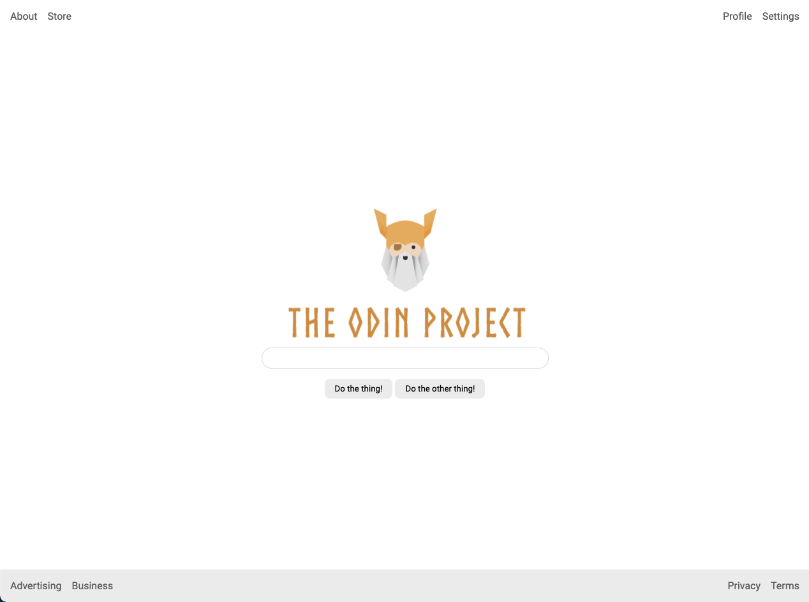

# An entire page!

Flexbox is useful for laying out entire pages as well as the smaller components we've already been working with. For this exercise, we're leaving you with a little more work to do, with some things you may not have encountered yet. It's perfectly acceptable to google things you're unsure of!

### Hints
- You may want to search something like `CSS remove list bullets`.  We've done this for you in previous examples, but not here. Yay learning.
- We've added `height: 100vh` to the `body`... this makes the body exactly the same height as the viewport. To stick the footer to the bottom you will need to use flex and change the direction to column.

## Desired Outcome

### Self Check

- The header is at the top of the page, the footer is at the bottom, and they stay in place if you resize your screen.
- The header and footer have padding.
- The links in the header and footer are pushed to either side.
- There is space between the links in the header and footer.
- The footer has a light gray background (`#eeeeee`).
- The logo, input and buttons are centered in the screen.
- The buttons have an appropriate amount of padding.
- There is space between the logo, input and buttons.
