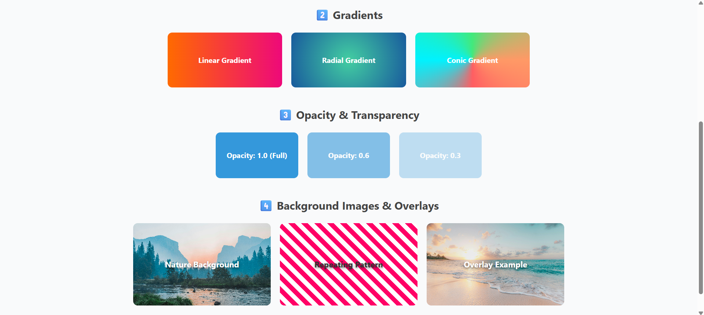

# 🧩 Exercise: Understanding CSS Selectors

In this exercise, you're going to practice using different **CSS selectors** — type, class, and ID — to style elements in an HTML file.  
This activity helps you understand how each selector targets HTML elements and how CSS specificity works.

> ## 💡 Quick Tip:
> Make sure to link your CSS file properly inside the `<head>` tag using the `<link>` element.  
> Remember that selector specificity matters — ID selectors override class selectors, and class selectors override type selectors.

---

## 🎯 Objective
You will style **three elements** using **three different selector types**:

* `h1` → styled using a **type selector**
* `p` → styled using a **class selector**
* `button` → styled using an **ID selector**

Use only **color keywords** (e.g. `blue`, `orange`, `green`) and **font sizes in px**.

---

## 🖌️ Properties to Apply

| Element | Selector Type | Properties |
|----------|----------------|-------------|
| `h1` | Type selector | Blue text, centered, 36px font size |
| `p` | Class selector | Green text, italic, 20px font size |
| `button` | ID selector | Orange background, white text, bold font |

---

## Desired Outcome

