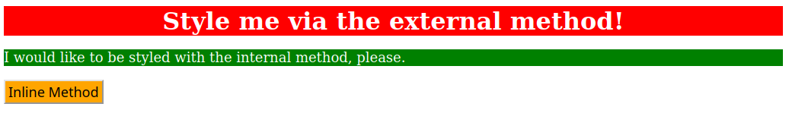

# Methods for Adding CSS
In this exercise, you're going to practice adding CSS to an HTML file using all three methods: external CSS, internal CSS, and inline CSS. You should only be using type selectors for this exercise when adding styles via the external and internal methods. You should also use keywords for colors (e.g. "blue") instead of using RGB or HEX values.

There are three elements for you to add styles to, each of which uses a different method of adding CSS to it, as noted in the outcome image below. All other exercises in this section will have a CSS file provided and linked for you, but for this exercise you will have to create the file and link it in the HTML file yourself. This is all about practicing using these different methods and getting the syntax right.

> ## Quick tip:
> Do not worry about details in these exercises that are not specifically mentioned in the exercise or self check section. Because the desired outcomes are screenshots, your browser may show a different font, the colors may appear different on your machine, or the spacing between elements may look different. Only concern yourself with the specific items you are supposed to be learning for each exercise.

The properties you need to add to each element are:

* `div`: a red background, white text, a font size of 32px, center aligned, and bold
* `p`: a green background, white text, and a font size of 18px
* `button`: an orange background and a font size of 18px

## Desired Outcome

### Self Check
- Did you use all three methods of adding CSS to an HTML file?
- Did you properly link the external CSS file in the HTML file?
- Does the `div` element have CSS added via the external method?
- Does the `p` element have CSS added via the internal method?
- Does the `button` element have CSS added via the inline method?
