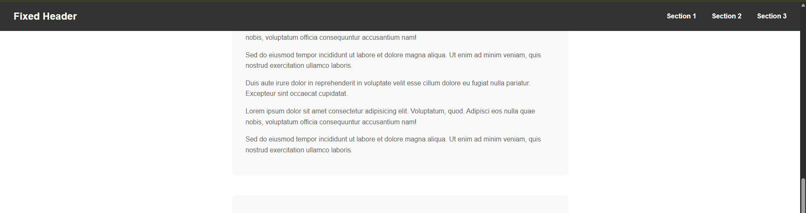

# Fixed Header

This exercise demonstrates how to create a header that stays fixed at the top of the viewport while the user scrolls through the page content.

You need to:
- Make the header stick to the top of the viewport using fixed positioning
- Ensure the header appears above all other content
- Add appropriate padding to the content so it's not hidden behind the header
- Make sure the header stays in place when scrolling

## Desired Outcome

### Self Check
- Does the header stay fixed at the top when you scroll?
- Is the header positioned above all other content?
- Is the main content properly spaced so it's not hidden behind the header?
- Do the navigation links work correctly?

### Hints
- Use `position: fixed` to make the header stick to the viewport
- Use `top: 0` to position it at the very top
- Use `z-index` to ensure it appears above other content
- Add `padding-top` to the main content equal to the header's height
- Consider the header's width - it should span the full viewport
