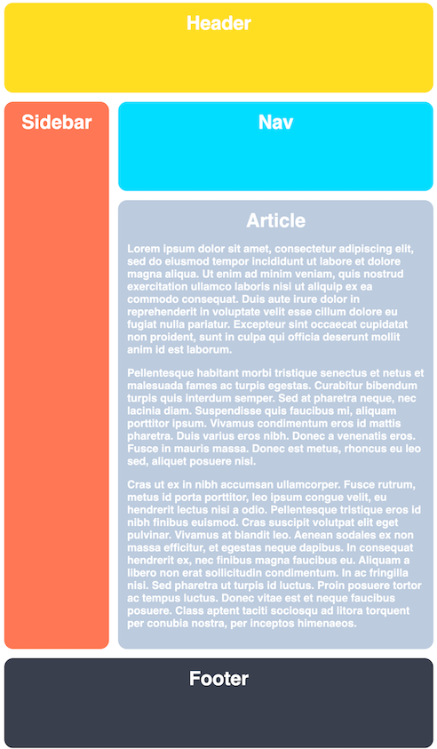
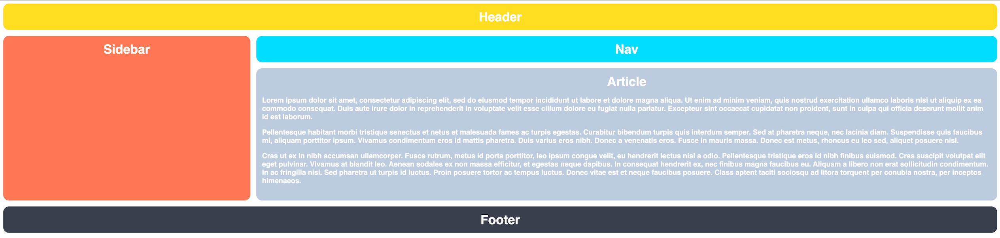

# Responsive Holy Grail Layout with Grid

This one is easy! We are going to take our Holy Grail Layout from the first exercise and make it responsive. To do this we will simply change our fixed track sizes to be dynamic. Consider this a warmup for the next exercise and make sure your layout is responding properly when resizing the window.

### Hints
- You only need to add to the CSS selectors
- Use dynamic track sizes for your columns and rows

## Desired Outcome

When the browser is narrow:

When the browser is stretched wide:

### Self Check
