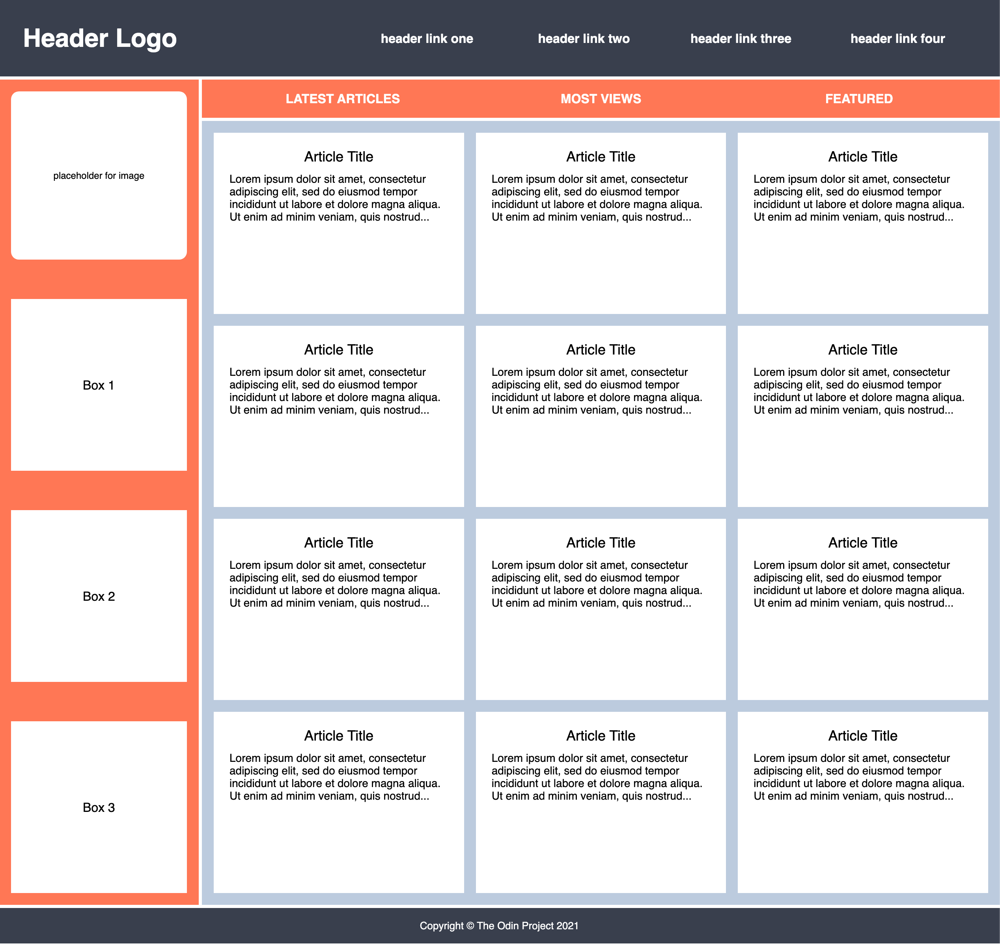

# Holy Grail Mockup with Grid

Now that you've made your Holy Grail layout responsive, we are going to have some fun making it a bit more complicated and adding some features. You might find this to be a bit more challenging than you expected. You might even be tempted to use Flexbox. But for the sake of this practice assignment, try and see if you can figure out how to recreate this entire mockup using only Grid. Feel free to add in your own dummy content too!

### Hints

## Desired Outcome

### Self Check