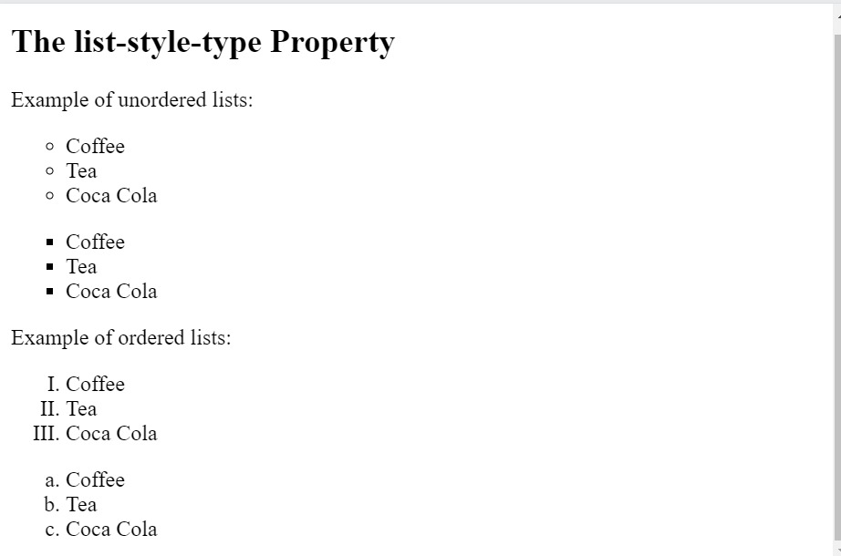

# An entire page!

In HTML, there are two main types of lists:
1- unordered lists (<ul>) - the list items are marked with bullets.
2- ordered lists (<ol>) - the list items are marked with numbers or letters.

The CSS list properties allow you to:
• Set different list item markers for ordered lists
• Set different list item markers for unordered lists
• Set an image as the list item marker
• Add background colors to lists and list items

Different List Item Markers:
The list-style-type property specifies the type of list item marker.

### Hints

Instructions:-
Step 1- Make an unordered list with 3 of it's items of list-style-type circle and next 3 items of list-style-type square.

Step 1- Make an ordered list with 3 of it's items of list-style-type upper-roman and next 3 items of list-style-type lower-alpha.

## Desired Outcome

### Self Check
- The display of all the items of the list is as per the desired outcome.

